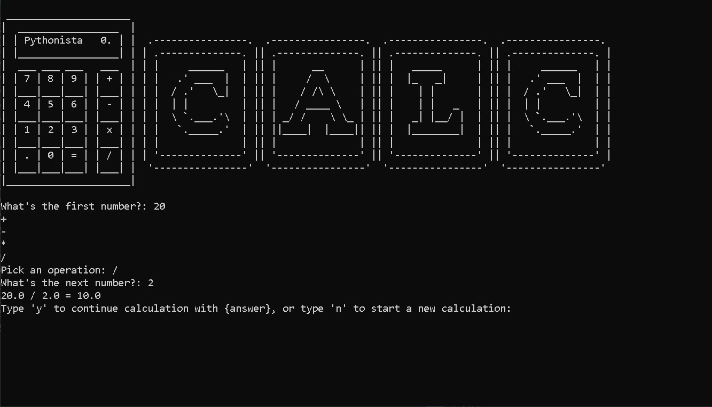

# Day 10 | #100DaysOfCode

## Functions With Outputs
This type of functions allow you to have an output once the function is completed. 
### Python return statement
The *python return statement* is special statement that you can use inside a function to sends the function's result back to the caller. A return statement consists of the return keyword followed by an optional return value. 

```python
# functions with outputs

def format_name(f_name, l_name):
  formated_f_name = f_name.title()
  formated_l_name = l_name.title()

  return f"{formated_f_name} {formated_l_name}"

print(format_name("ProGrammer", "NABIN"))
# output: Programmer Nabin
```

Statements after the return line will not be executed.

<hr>

## days-in-month.py
This program will take year and month as a input and returns the number of days in that month. [Run this program on replit](https://replit.com/@nabinbhatt/days-in-month?output=1&embed=1)

```python
def is_leap(year):
    if year % 4 == 0:
        if year % 100 == 0:
            if year % 400 == 0:
                return True
            else:
                return False
        else:
            return True
    else:
        return False

def days_in_month(year, month):
    """returns the number of days in the month"""
    month_days = [31, 28, 31, 30, 31, 30, 31, 31, 30, 31, 30, 31]  
    if is_leap(year) and month == 2:
        return 29
    return month_days[month - 1]

year = int(input("Enter a year: "))
month = int(input("Enter a month: "))
days = days_in_month(year, month)
print(days)
```

### Docstrings
A docstring is a string literal that occurs as the first statement in a module, function, class, or method definition used to document a Python module, class, function or method.

<hr>

## And made this awesome project: [calculator](/day10/calculator/)
