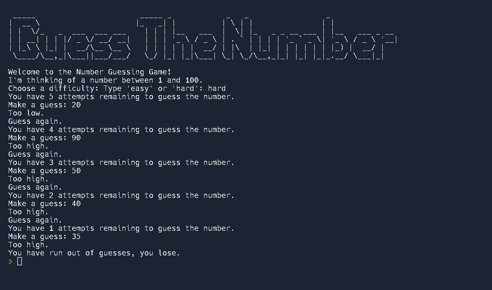

# Day 12 | #100DaysOfCode

Today, I learned about
- Namespaces: local vs. global scope
- Modifying a global variable
- Constants in Python
- And made the final project [Guess The Number](https://replit.com/@nabinbhatt/guess-the-number?output=1&embed=1) Game

## Local Scope

A varaible created inside the function belongs to the local scope of that function, and it can only be used inside the function. In the example below, `my_variable` is not available outside the function.

```python
def example():
    my_variable = 3
    print(my_variable)

example()
```

But, it is available for any function inside the `example` function. For example:

```python
def example():
    my_variable = 3
    print(my_variable)

    def inner_function():
        print(my_variable) #output: 3

    inner_function()

example()
```

## Global Scope

A variable created in the main body of the python file belongs to global scope and available from any scope, local and global.

```python
global_variable = 4

def example():
    print(global_variable) #output: 4

example()
print(global_variable) #output: 4
```

If you use the same name for declaring variable in global and local scope, python will treat them as two seperate variables.

```python
my_variable = 4

def example():
    my_variable = 3
    print(my_variable) #output: 3

example()
print(global_variable) #output: 4
```

## Global Keyword
The global keywod makes the variable global

```python
def example():
    global my_variable = "python"

print(my_variable) #output: python
```

Also, if you want to change the value of global variable inside a function, use the global keyword the change the scope to global at first.

```python
x = 3

def example():
    global x
    x = 5
    print(x) #output: 5

example()
```
# Guess The Number Game

Run this game on Replit by clicking [here](https://replit.com/@nabinbhatt/guess-the-number?output=1&embed=1)

## References & Credits
- [Udemy](https://www.udemy.com/course/100-days-of-code/)
- [python.org](https://docs.python.org/3/tutorial/classes.html#python-scopes-and-namespaces)
- [w3schools](https://www.w3schools.com/python/python_scope.asp)